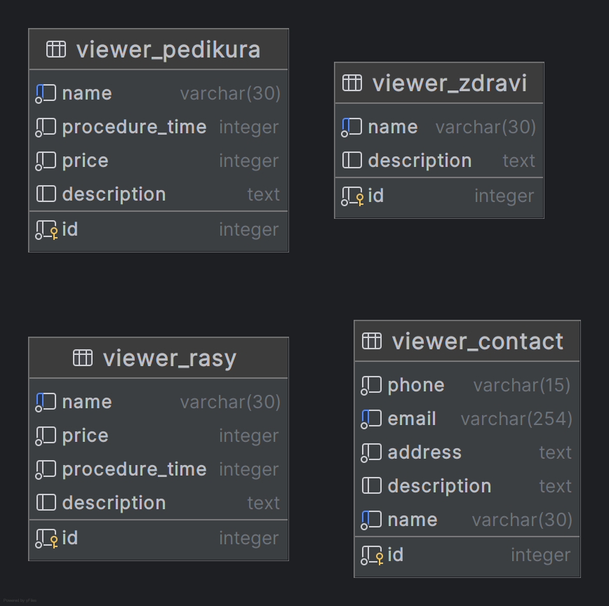
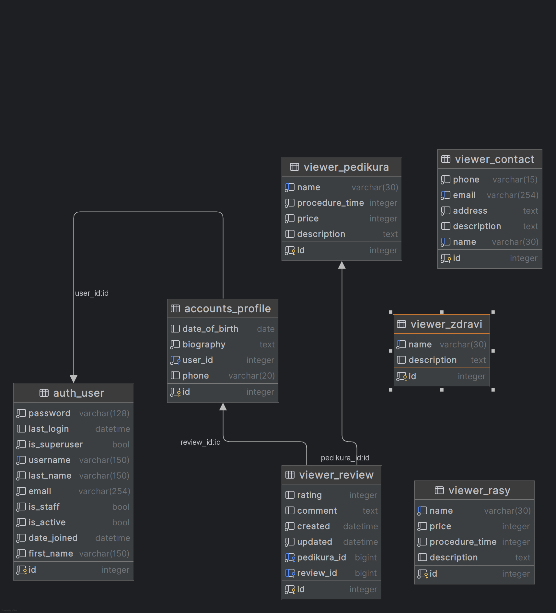
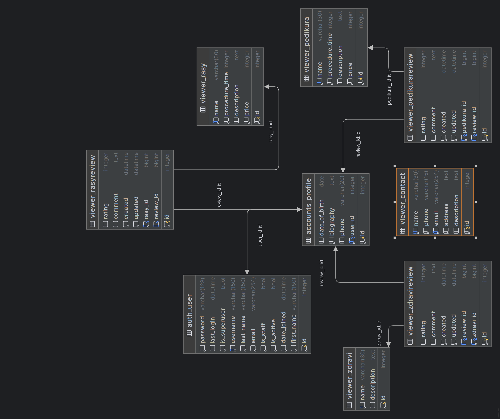

# Webová aplikace LoubNaturál
  SDA PythonRemoteZ4073-Závěrečný projekt.

# Úvod
  Vítejte v repozitáři závěrečného projektu v kurzu programování v Pythnu od SDA.
  Tato webová aplikace je navržená pro kamarádku kosmetičku, prezentace podnikání,přehled o svých zakaznicích a jejich požadavcích.
# Kroky ke spuštění
  1. Instalace závislostí: Před spuštěním aplikace je nezbytne nainstalovat potřebné závislosti. 
     Použite  příkaz ' pip install -r requirements.txt ' pro instalaci balíčků.
  2. Databáze: Aplikace využívá databázi pro ukládání dat. Vytvořte databázipomocí příkazu
```bash
   python manage.py makemigrations
```
```bash 
   python manage.py migrate
 ``` 

  3. Spuštění serveru: Spusťte vývojový server příkazem 
```bash
  python manage.py runserver
```
   a přejděte na  adresu http://127.0.0.1:8000/ ve svém prohlížeči, zastavení serveru Ctrl+c 

## Popis projektu - databáze
 -[x] Pedikúra
   - Název ošetření + popis
     - Pedikúra basic 
     - Pedikúra plus
     - Pedikúra lady
     - Pedikúra pánská
     - Odstranění gel laku
     - Obrázky
     
 -[x] Řasy + popis
   - Název ošetření + popis
    - Hollywoodský objem
    - Odstranění řas
    - Řasa na řasu
    - Řasy 2D objem
    - Obrázky

-[x] Zdraví + popis
  - Koloidní stříbro
  - Diochi
  - Obrázky

-[x] Kontakt
  - Název
  - Adresa 
  - Telefon
  - Email
  - Popis
  - Obrázky

-[x] Objednávky
  - Zobrazení objednávky pro přihlášené, základní informace
    (čas objednání, profil-procedůra, datum vytvoření)
  
-[x] Review
  - review (-> Profile)
  - rating (Integer, 1-5 *)
  - comment (String)
  - created (DateTime)
  - updated (DateTime)
  - 
-[x] Obrazky
  - image (soubor)
  - Stránkování
  
-[x] API
  - Svátek aktuální den
    
-[x] Vyhledávač
  - Vyhledávač (Výpis roztřízení)
    BYLA SNAHA Google funguje jen jsem nastavila špatné (málo) stránek které má prohledávat.
  - 




## Profil - registrace
  - Uživatelské jméno
  - Jméno příjmení
  - Email
  - Heslo + Heslo potvrzení
  - Telefon (1:n -> Telefon)
  - Email (1:n -> Email )
  - Datum narození (Date)
  - Biografie
  
## Přihlášení pomocí  
  - Uživatelského jména
  - Hesla
  - Možnost změna hesla

## Django
### Instalace
 ```bash
   pip install django, kontrola nainstalovaného balíčku 
   pip freeze > requirements.txt
    django-admin startproject zaverecny_project .
   pip install dotenv
 ````
### Admin panel
 - vytvoření superuser : 
 ```bash
   python manage.py createsuperuser
 ````
 - do souboru ' viewer.admin.py ' zaregistrujeme vytvořený model:
   - from viewer.models import Pedikura
   - admin.site.register(Pedikura)


## Aplikace
### Vytvoření aplikace
 - v terminálu spuštění přes příkaz 
 ```bash
  python manage.py startapp viewer 
 ```
> [ ! WARNING ]
> Nesmíme zapomenout zaregistrovat aplikaci do souboru  ' setings.py ' 
 - složku s názvem projektu

### DUMP/LOAD databaze
 ```bash
   pip django-dump-load-utf8==0.0.4 
 ```
- Přidáme ' django_dump_load_utf8 ' do seznamu
  nainstalovaných aplikací v ' settings.py - INSTALLED_APPS '
  taky přidame do seznamu ' requirements.txt '

# Dump
```bash
 python manage.py dumpdatautf8 viewer --output .\zaloha\fixtures.json'
 ```
# Load
```bash 
 python manage.py loaddata .\zaloha\fixtures.json
```

### Celý projekt
  - jsou použíté autentizace 
  - testy pro kontrolu funkcionalit aplikace
  - v admin panelu nastavení autorizačních preferencí pro uživatele

    Děkuji za pozornost. Pokud máte nějaké otázky nebo problémy, neváhejte mě kontaktovat. 

